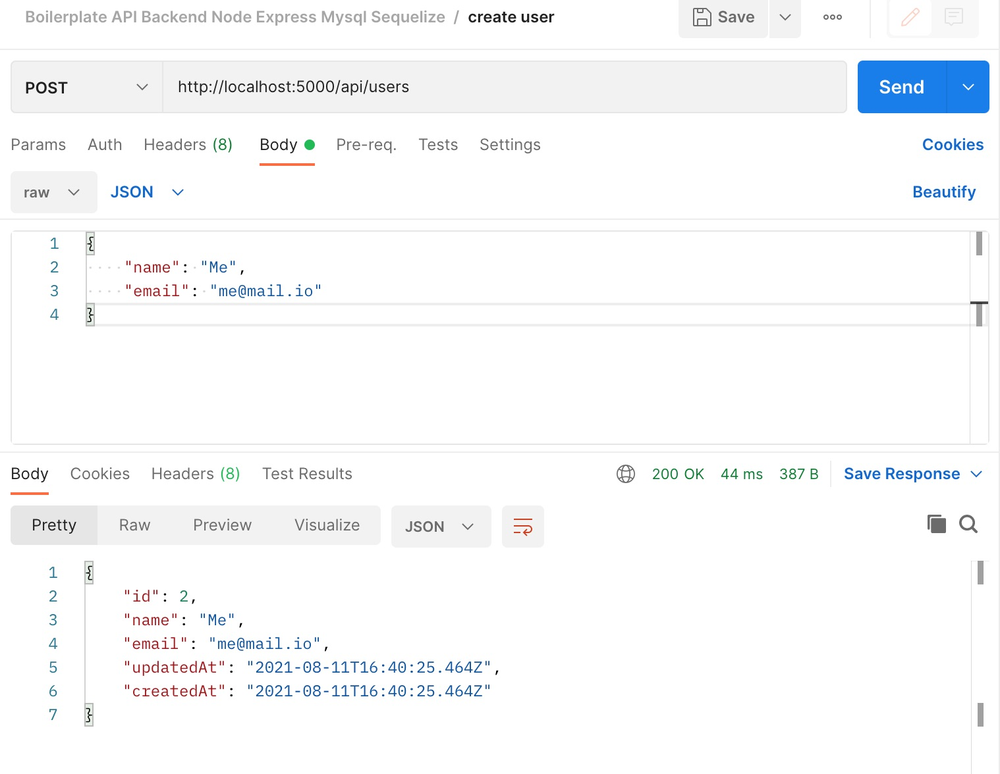

# my-api-project (Node-Express-Mysql-Sequelize)

## A backend boilerplate API
> (node - express - mysql - sequelize)

</br>

### Fork from this source : <a href="https://github.com/sbalasubramanian14/generator-express-mysql-boilerplate" target="_blank">generator-express-mysql-boilerplate</a>

</br>

### Installation with 'Yeoman' : <a href="https://yeoman.io" target="_blank">yeoman.io</a>

> First, install Yeoman and generator-express-mysql-boilerplate using npm (we assume you have pre-installed node.js).
```
npm install -g yo
npm install -g generator-express-mysql-boilerplate 
```
> And Then generate your new project:
```
yo express-mysql-boilerplate
```
</br>

## Demo instructions :

### ➜  Launch 'Mysql' (ex. on Mac OS) :
```
brew services start mysql
```
</br>

### ➜  And verify (ex. on Mac OS) :
```
brew services list
```
</br>

### ➜  Create in 'Mysql' (or with 'MySQLWorkbench') a new database with the name of your choice (ex. 'mydatabase') :
```
mysql -u root -p --default-character-set=utf8
```
> And type your 'root' password, then :
```
CREATE DATABASE mydatabase;
```
</br>


### ➜  Install 'sequelize-cli' with 'npm' :
```
npm i sequelize-cli;
```
</br>

### ➜  Change the params (username, password, database, ...) of file : 'config/config.json'
```
"development": {
    "username": "root",
    "password": "new_password",
    "database": "mydatabase",
    "host": "127.0.0.1",
    "dialect": "mysql",
    "operatorsAliases": false
  },
  ...
```
</br>

### ➜  And in the file : 'src/database/connection.js'
```
const Sequelize = require("sequelize");

const sequelize = new Sequelize(
  "mydatabase",
  "root",
  "new_password",
  {
    host: "127.0.0.1",
    dialect: "mysql"
  }
);

module.exports = sequelize;
global.sequelize = sequelize;

```
</br>

### ➜  Run 'sequelize-cli' to create new 'tables' (with models in 'src/models/'  ex. 'User.js') :
```
npx sequelize db:migrate
```
</br>

### ➜  Refresh 'Mysql' (or in 'MySQLWorkbench') to verify the new 'tables' creation (ex. 'users').
</br>

### ➜ Run the server :
```
npm run dev
```
### ➜ With your browser go to 'http://localhost:5000' (if you see a blank page with 'my-api-project', it's ok!).
</br>

### ➜ Add a user with 'Postman' :
> Choose 'POST' :
```
http://localhost:5000/api/users
```
> Choose 'Body' + 'raw' & 'JSON' :
```
{
    "name": "Me",
    "email": "me@mail.io"
}
```
> click on 'Send', and the result must be :
```
{
    "id": 2,
    "name": "Me",
    "email": "me@mail.io",
    "updatedAt": "2021-08-11T16:40:25.464Z",
    "createdAt": "2021-08-11T16:40:25.464Z"
}
```



### ➜  And verify in 'Mysql' (or with 'MySQLWorkbench')  :
```
USE mydatabase;

SELECT * FROM mydatabase.users;
```
> It returns :
```
+----+--------+------------------+---------------------+---------------------+
| id | name   | email            | createdAt           | updatedAt           |
+----+--------+------------------+---------------------+---------------------+
|  1 | Naruto | Naruto@gmail.com | 2021-08-11 12:37:25 | 2021-08-11 12:37:25 |
|  2 | Me     | me@mail.io       | 2021-08-11 16:40:25 | 2021-08-11 16:40:25 |
+----+--------+------------------+---------------------+---------------------+
2 rows in set (0,00 sec)
```
</br>
